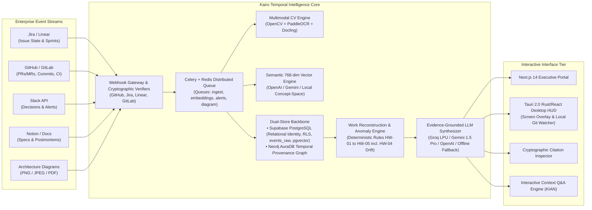
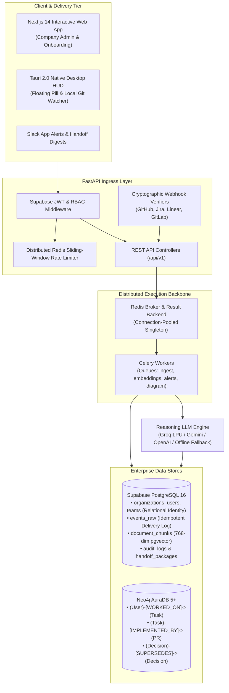

# KAIRO: AI-Powered Enterprise Work Continuity & Temporal Knowledge Engine

[](https://opensource.org/licenses/Apache-2.0)
[](https://www.python.org/)
[](https://nodejs.org/)
[](https://fastapi.tiangolo.com/)
[](https://nextjs.org/)
[](https://supabase.com/)
[](https://neo4j.com/)
[](https://github.com/astral-sh/ruff)
[](https://www.typescriptlang.org/)

---

## 1. Executive Summary & Purpose

In modern engineering and product organizations, team reassignments, employee departures, extended leaves, and emergency on-call handoffs lead to massive **engineering context loss**. Critical technical knowledge remains fragmented across siloed enterprise systems:
* **Declared State:** Jira / Linear tickets (frequently stale or prematurely marked "Done").
* **Observed Implementation:** GitHub PRs, commits, branch diffs, CI test logs, and code reviews.
* **Informal Rationale & Debates:** Slack / Microsoft Teams threads, incident post-mortems, and design docs.
* **Visual Architecture Knowledge:** Architecture diagrams, whiteboard snapshots, and entity schemas.

**Kairo** solves this breakdown by continuously aggregating cross-tool engineering activity into a **permission-aware, temporal organizational knowledge graph**. Whenever an ownership transition event occurs (e.g., Jira reassignment, offboarding webhook, or manual trigger), Kairo automatically generates a concise, citation-backed **Interactive Handoff Briefing** answering the six core questions every incoming engineer faces:

1. **Active Context:** What was the previous owner *actually working on*?
2. **Verified State:** What has been *completed and verified in code*?
3. **In-Flight Work:** What remains *unfinished, blocked, or in review*?
4. **Decision Lineage:** *Why* were architectural choices made (and which alternatives were rejected)?
5. **Hidden Hazards:** What *historical failure modes, incidents, and hidden dependencies* exist?
6. **Day-1 Action:** What exact action should the incoming engineer *execute first*?



---

## 2. Technology Stack & Architectural Rationale

Kairo is built upon modern, high-throughput, and production-tested 2026 cloud-native primitives:

| Layer | Technology | Version | Architectural Rationale |
| :--- | :--- | :--- | :--- |
| **Web Portal** | **Next.js (App Router)** | `14.2+` / `15.x` | Server-Side Rendering (SSR), React Server Components (RSC), and edge-ready API routes for company admin and onboarding. |
| **Desktop Client** | **Tauri 2.0 (Rust + React)**| `2.0+` | Ultra-lightweight native floating screen overlay HUD with background local Git repository watcher daemon. |
| **UI Design System** | **Tailwind CSS + shadcn/ui** | `3.4+` | Accessible (Radix UI), responsive, enterprise dark-mode ready, zero runtime overhead. |
| **Backend API Gateway** | **FastAPI** | `0.111+` | High-performance asynchronous ASGI framework with native OpenAPI 3.1 generation and strict Pydantic v2 validation. |
| **Distributed Rate Limiter**| **Redis Sorted Sets** | `7.x` | Shared sliding-window rate limiting across horizontally scaled API gateway replicas. |
| **Background Task Queue**| **Celery + Redis** | `5.4+` | Decoupled asynchronous worker model with Redis broker & result backend; dedicated queues (`ingest`, `embeddings`, `alerts`, `diagram`). |
| **Relational & Vector DB**| **Supabase PostgreSQL** | `16+` (`pgvector 0.7+`)| ACID compliance, multi-tenant Row-Level Security (RLS), relational enterprise identity, idempotent `events_raw` log, and dense 768-dim vectors. |
| **Knowledge Graph** | **Neo4j AuraDB** | `5.20+` | Native labeled property graph with Cypher queries for temporal validity slicing and 2-hop dependency traversal. |
| **Semantic Embeddings** | **OpenAI / Gemini / Concept Space**| 768-dim | Cloud API embedding models (`text-embedding-3-small`, `text-embedding-004`) with deterministic 768-dim concept-space projection fallback. |
| **Diagram & Spec Parsing** | **PIL + OCR Layout Analysis**| Latest | Bounding box analysis, color classification, and text block parsing extracting architectural entities from diagrams and specifications (OpenCV/PaddleOCR target extension). |
| **Reasoning LLM** | **Groq / Google Gemini / OpenAI**| Latest | High-speed LPU / multimodal inference ($T=0.1$) with structured output constraints, mandatory inline citation enforcement, and offline fallback. |

---

## 3. High-Level System Architecture

The system operates as an **Event-Driven Modular Monolith** coupled with an asynchronous processing pipeline:



---

## 4. Local Development & Quickstart Runbook

Follow these steps to run the complete Kairo stack locally in development mode.

### 4.1. Prerequisites
* **Python:** `3.11` or `3.12` installed (recommend [`uv`](https://github.com/astral-sh/uv))
* **Node.js:** `20.x LTS` and [`pnpm`](https://pnpm.io/) (`corepack enable pnpm`)
* **Docker & Docker Compose:** Docker Desktop or Colima
* **Tunneling Tool (for webhooks):** `ngrok` or `cloudflared`

### 4.2. Clone and Setup Environment
```bash
# 1. Clone repository
git clone https://github.com/your-org/kairo.git
cd kairo

# 2. Copy and configure environment variables
cp .env.example .env
```

### 4.3. Run with Docker Compose (Recommended)
```bash
# Build and start all services (API, Worker, Web)
docker-compose up --build -d

# Verify container health
docker-compose ps
```

### 4.4. Manual Local Execution (Native Fast Mode)
```bash
# Terminal 1: Backend API (FastAPI)
cd apps/api
uv venv .venv && source .venv/bin/activate  # On Windows: .venv\Scripts\activate
uv pip install -r requirements.txt
uvicorn app.main:app --host 0.0.0.0 --port 8000 --reload

# Terminal 2: Celery Background Worker
cd workers
celery -A celery_app worker --loglevel=info -Q ingest,embeddings,alerts,diagram --concurrency=4

# Terminal 3: Frontend Web Dashboard (Next.js)
cd apps/web
pnpm install
pnpm dev
```

* **Frontend Dashboard:** [http://localhost:3000](http://localhost:3000)
* **Backend API Docs (Swagger UI):** [http://localhost:8000/docs](http://localhost:8000/docs)
* **Backend OpenAPI Spec:** [http://localhost:8000/openapi.json](http://localhost:8000/openapi.json)

---

## 5. Environment Variables Reference

| Variable Name | Required | Default / Format | Description |
| :--- | :---: | :--- | :--- |
| `APP_ENV` | Yes | `development` \| `staging` \| `production` | Deployment runtime target. In production, fail-fast validations are enforced. |
| `SECRET_KEY` | Yes | High-entropy hex string (`openssl rand -hex 32`) | JWT signature validation & AES encryption key (min 32 chars). |
| `ACCESS_TOKEN_EXPIRE_MINUTES` | No | `1440` (24h) | JWT expiration lifetime in minutes. |
| `DATABASE_URL` | Yes | `postgresql://postgres:<pwd>@<host>:5432/postgres` | PostgreSQL connection string for DDL, migrations, and event storage. |
| `SUPABASE_URL` | Yes | `https://<ref>.supabase.co` | Supabase project API gateway endpoint. |
| `SUPABASE_SERVICE_ROLE_KEY` | Yes | `eyJhbGciOi...` | Supabase privileged service role API key. |
| `NEO4J_URI` | Yes | `bolt://localhost:7687` \| `neo4j+s://...` | Neo4j AuraDB Bolt connection URI. |
| `NEO4J_USER` | Yes | `neo4j` | Neo4j database username. |
| `NEO4J_PASSWORD` | Yes | `<secure-password>` | Neo4j database authentication password. |
| `REDIS_URL` | Yes | `redis://localhost:6379/0` \| `rediss://...` | Redis connection string for distributed rate limiter and Celery broker/backend. |
| `GITHUB_WEBHOOK_SECRET` | Yes | High-entropy secret string | Secret for GitHub HMAC-SHA256 signature verification (`X-Hub-Signature-256`). |
| `JIRA_WEBHOOK_SECRET` | Yes | High-entropy secret string | Secret for Jira webhook signature verification (`X-Hub-Signature`). |
| `LINEAR_WEBHOOK_SECRET` | Yes | High-entropy secret string | Secret for Linear HMAC-SHA256 signature verification (`Linear-Signature`). |
| `GITLAB_WEBHOOK_SECRET` | Yes | High-entropy secret string | Secret token for GitLab webhook verification (`X-Gitlab-Token`). |
| `SLACK_WEBHOOK_URL` | No | `https://hooks.slack.com/services/...` | Incoming Slack webhook URL for alerts and handoff digests. |
| `SLACK_SIGNING_SECRET` | Yes | High-entropy secret string | Secret for verifying Slack Events API HMAC-SHA256 signatures (`X-Slack-Signature`). |
| `SLACK_BOT_TOKEN` | No | `xoxb-...` | Slack Bot User OAuth Token for fetching thread replies and channel history. |
| `MAX_DAILY_LLM_SPEND_USD` | No | `10.00` | Maximum daily LLM spend ceiling in USD per organization before throttling extraction. |
| `SLACK_NOISE_MIN_WORDS` | No | `15` | Minimum word count for standalone Slack messages to bypass noise drop. |
| `DECISION_CONFIDENCE_THRESHOLD` | No | `0.70` | Minimum confidence score to write directly to Neo4j; decisions below route to review queue. |
| `ENABLE_SLACK_INGESTION` | No | `true` | Feature flag to toggle inbound Slack webhook handling and decision extraction. |
| `ENABLE_HISTORICAL_BACKFILL` | No | `true` | Feature flag to toggle 120-day historical cloud backfill jobs. |
| `GROQ_API_KEY` | Conditional | `gsk_...` | Groq high-speed inference API key. |
| `GEMINI_API_KEY` | Conditional | `AIzaSy...` | Google Gemini Pro/Flash & text-embedding-004 API key. |
| `OPENAI_API_KEY` | Conditional | `sk-proj-...` | OpenAI API key for GPT models & text-embedding-3-small. |
| `LLM_MODEL_NAME` | No | `gemini-1.5-pro` | Model identifier for grounded synthesis. |
| `LLM_TEMPERATURE` | No | `0.1` | LLM generation temperature (default 0.1 for deterministic synthesis). |
| `CORS_ORIGINS` | No | `["http://localhost:3000","http://localhost:1420","tauri://localhost"]` | Allowed CORS origins JSON list (wildcard forbidden in production). |
| `NEXT_PUBLIC_API_URL` | No | `http://localhost:8000` | Frontend backend API URL target. |

---

## 6. Testing, Quality & Linting Commands

```bash
# Run Backend Unit and Integration Tests with Coverage
cd apps/api
pytest --cov=app --cov-report=term-missing --cov-report=html --cov-fail-under=85

# Run Python Linter & Formatter Check
ruff check .
ruff format --check .

# Run Strict Type Checking
mypy app

# Run Frontend Unit Tests
cd apps/web
pnpm test

# Run End-to-End Browser Tests
pnpm test:e2e

# Run Frontend Linting & Typecheck
pnpm lint
pnpm type-check
```

---

## 7. Monorepo Directory Layout

```text
kairo/
├── .github/                     # GitHub Actions CI/CD workflows
├── apps/
│   ├── api/                     # FastAPI backend application
│   │   ├── app/
│   │   │   ├── api/             # REST endpoints (auth, handoff, chat, context, sync, team, webhooks)
│   │   │   ├── core/            # Config, security, database connections, logging
│   │   │   ├── engines/         # Reconstruction, temporal, hidden-work anomaly rules
│   │   │   └── services/        # Neo4j, Supabase, LLM abstraction services
│   │   ├── tests/               # Backend unit, integration & contract tests
│   │   ├── Dockerfile
│   │   └── requirements.txt
│   ├── desktop/                 # Tauri 2.0 (Rust + React) native floating screen overlay HUD
│   └── web/                     # Next.js 14 company administration portal
│       ├── app/                 # App Router pages (dashboard, onboarding, auth)
│       ├── components/          # Reusable UI components
│       ├── Dockerfile
│       └── package.json
├── workers/                     # Celery background workers
│   ├── tasks/                   # Ingestion, OCR, and synthesis task handlers
│   └── celery_app.py
├── packages/
│   ├── schemas/                 # Shared Pydantic models & TypeScript types
│   └── prompts/                 # Versioned, cited LLM prompt templates
├── cv_pipeline/                 # Diagram bounding box and text block parsing scripts (PIL/OCR)
├── graph/                       # Cypher migrations & query library
├── db/                          # Supabase PostgreSQL DDL migrations & RLS policies
├── fixtures/                    # Seeded test scenarios (Rahul -> Aman transition)
├── docs/                        # Deep-dive domain technical specifications
│   ├── 01-architecture-and-system/
│   ├── 02-integrations-and-connectors/
│   ├── 03-api-and-contracts/
│   ├── 04-security-and-compliance/
│   ├── 05-devops-and-operations/
│   ├── 06-quality-and-testing/
│   ├── 07-research-and-benchmarks/
│   └── README.md
├── docker-compose.yml           # Local multi-service orchestration
├── .env.example                 # Environment configuration template
├── README.md                    # This document
├── CONTRIBUTING.md              # Git workflows and engineering guidelines
├── CHANGELOG.md                 # Semantic versioning release changelog
└── AGENTS.md                    # Universal AI Coding Agent Contributor Guide
```

---

## 8. Deep-Dive Documentation Portal

All detailed domain and subsystem specifications live inside [`docs/`](file:///c:/Users/adity/OneDrive/Personal%20Vault/Desktop/Kairo/docs/README.md):

* **[Architecture & Systems](file:///c:/Users/adity/OneDrive/Personal%20Vault/Desktop/Kairo/docs/01-architecture-and-system/overview.md)** — C4 models, data models, state machines, and ADRs.
* **[Integrations & Connectors](file:///c:/Users/adity/OneDrive/Personal%20Vault/Desktop/Kairo/docs/02-integrations-and-connectors/jira-cloud.md)** — Jira Cloud, GitHub App, Linear App, GitLab, Slack Events API, and Notion.
* **[API & Webhook Contracts](file:///c:/Users/adity/OneDrive/Personal%20Vault/Desktop/Kairo/docs/03-api-and-contracts/rest-endpoints.md)** — REST endpoints, OpenAPI schemas, and RFC 7807 error formats.
* **[Security & Governance](file:///c:/Users/adity/OneDrive/Personal%20Vault/Desktop/Kairo/docs/04-security-and-compliance/threat-model.md)** — STRIDE threat modeling, pre-prompt ACL filtering, and encryption.
* **[DevOps & Deployment](file:///c:/Users/adity/OneDrive/Personal%20Vault/Desktop/Kairo/docs/05-devops-and-operations/deployment-guide.md)** — $0 Free-Tier vs. Kubernetes Helm, and OpenTelemetry observability.
* **[Quality & Testing](file:///c:/Users/adity/OneDrive/Personal%20Vault/Desktop/Kairo/docs/06-quality-and-testing/test-pyramid.md)** — Testing pyramid, Testcontainers, and CI merge gates.
* **[Research & Evaluation](file:///c:/Users/adity/OneDrive/Personal%20Vault/Desktop/Kairo/docs/07-research-and-benchmarks/research-questions.md)** — Academic research questions (RQ1–RQ5) and benchmark metrics.

---

## 9. Support & License

* **License:** Distributed under the **Apache 2.0 License**. See `LICENSE` for details.
* **Security Advisories:** Please report vulnerabilities in accordance with our [Security Policy](file:///c:/Users/adity/OneDrive/Personal%20Vault/Desktop/Kairo/docs/04-security-and-compliance/threat-model.md).
* **Maintainers:** Kairo Engineering Architecture Team (`engineering@kairo.dev`).
