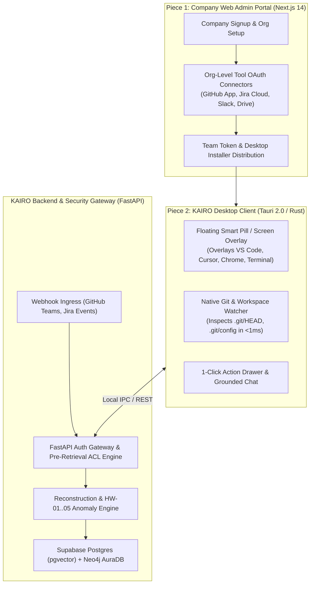
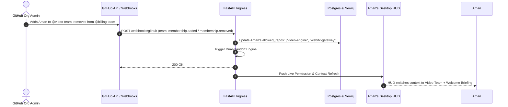
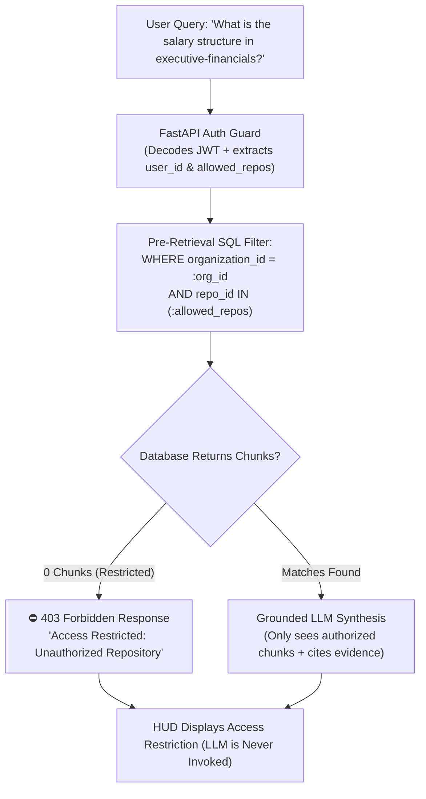

# KAIRO: Desktop Floating HUD & Dynamic Access Control Specification

> **Domain:** Architecture & System Design  
> **Document ID:** KAIRO-ARCH-DESKTOP-ACL  
> **Status:** Production-Ready / Approved  
> **Scope:** Tauri 2.0 Desktop Floating Overlay, Native Git State Detection, GitHub Teams Dynamic RBAC Sync, and Pre-Retrieval ACL Guards

---

## 1. System Topology: 2-Piece Delivery Paradigm

Rather than forcing engineers into a bloated third-party web dashboard, KAIRO separates administration from day-to-day developer continuity:



---

## 2. Desktop Floating HUD & Active Task Detection Pipeline

The developer client is an ultra-lightweight (**< 15MB RAM**) native application built with **Tauri 2.0 (Rust backend + React frontend)**.

### 2.1. Active Task Detection Mechanisms

```
┌─────────────────────────────────────────────────────────────────────────┐
│              ACTIVE WORKSPACE & TASK DETECTION PIPELINE                 │
├─────────────────────────────────────────────────────────────────────────┤
│ 1. NATIVE LOCAL GIT WATCHER (Tauri Rust Engine - < 1ms)                 │
│    Tauri app locally `.git/HEAD` aur `.git/config` watch karta hai.     │
│    ➔ Extracted: Repo = `billing-service`, Branch = `feat/razorpay`      │
│                                                                         │
│ 2. BRANCH REGEX PARSER                                                  │
│    `feat/(?P<ticket>[A-Z]+-\d+)` ➔ Extracts `BILL-204`                  │
│                                                                         │
│ 3. JIRA IN-PROGRESS CLOUD RECONCILIATION                                │
│    Validates against active assigned in-progress issues for current dev │
└─────────────────────────────────────────────────────────────────────────┘
```

1. **Local Git Watcher (Rust `notify` crate):**
   - Tauri monitors active workspace directory `.git/HEAD` and `.git/config`.
   - `.git/HEAD` changes instantly on `git checkout <branch>`: returns branch reference in `< 1ms`.
   - Remote URL in `.git/config` maps to canonical repository identifier (e.g. `snapmeet/billing-service`).
2. **Branch-to-Issue Resolution:**
   - Regex extracts issue keys: `feat/BILL-204-razorpay` $\to$ `BILL-204`.
   - Fallback: Queries backend for active `In Progress` Jira tickets assigned to the developer that match the modified repository and file paths.

---

## 3. Dynamic Access Control & Pre-Retrieval ACL Enforcement

### 3.1. Automatic Permission Inheritance from GitHub & Jira

Zero manual permissions configuration is required from managers. KAIRO dynamically inherits access boundaries:

1. **GitHub Teams API Ingestion:**
   - Calls `GET /orgs/{org}/teams` and `GET /orgs/{org}/teams/{slug}/repos`.
   - Maps developer `@aman-v` $\to$ `@snapmeet/billing-team` $\to$ `allowed_repos = ["billing-service", "auth-service"]`.
2. **Jira Project Permissions:**
   - Inherits Jira project-level browsable access (`GET /rest/api/3/mypermissions`).

### 3.2. Real-Time Team Shift Webhook Ingress

When an employee shifts squads (e.g., Aman moves from Billing Team to Video Team):



1. **Old Squad Safe Offboarding:** In-flight unmerged branches and PRs in `billing-service` are flagged and suggested for reassignment to teammates.
2. **New Squad Instant Onboarding:** The Desktop HUD immediately loads architecture specs, active sprints, and recent technical decisions for `video-engine`.

---

## 4. Pre-Retrieval ACL Security Architecture

When a developer interacts with the Desktop Q&A Chatbot, data isolation is enforced **before** context is fetched or passed to any LLM prompt:



1. **Token Scoping:** Every request carries a cryptographically signed JWT containing `org_id`, `user_id`, and active `allowed_repo_ids`.
2. **Pre-Prompt Pruning:** Supabase `pgvector` and Neo4j Cypher queries inject strict tenant and repository whitelist parameters.
3. **Fail-Closed Gate:** If 0 authorized chunks match, the LLM is never invoked, completely eliminating token leakage and hallucinated leaks.
