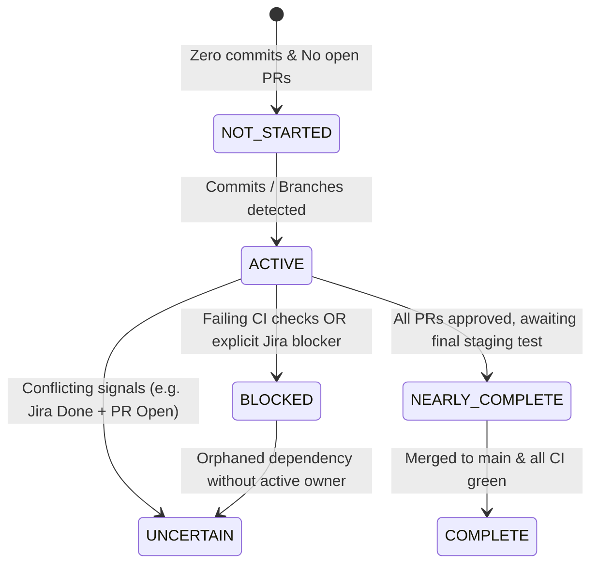
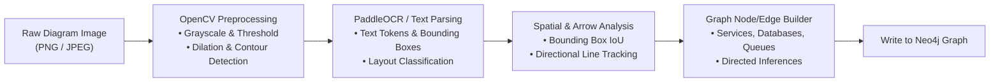

# KAIRO: Core Engines, State Machines & Algorithms

> **Domain:** Architecture & System Design  
> **Document ID:** KAIRO-ARCH-ALGO  
> **Scope:** Algorithmic Foundation, Deterministic Rule Engines & Computer Vision

---

## 1. Work Reconstruction Engine (State Machine)



### Deterministic State Estimation Logic
```python
def estimate_work_state(declared_status: str, github_prs: list, commits: list, ci_status: str) -> str:
    if not commits and not github_prs and declared_status in ["To Do", "Backlog"]:
        return "NOT_STARTED"
    
    open_prs = [pr for pr in github_prs if pr.state == "open"]
    merged_prs = [pr for pr in github_prs if pr.state == "merged"]
    
    # Inconsistency Check
    if declared_status in ["Done", "Closed"] and open_prs:
        return "UNCERTAIN_INCOMPLETE_PR"
        
    if open_prs:
        if any(pr.ci_status == "failing" for pr in open_prs):
            return "BLOCKED_BY_CI"
        if all(pr.review_decision == "APPROVED" for pr in open_prs):
            return "NEARLY_COMPLETE"
        return "ACTIVE"
        
    if merged_prs and declared_status in ["Done", "Resolved"]:
        return "COMPLETE"
        
    return "ACTIVE"
```

---

## 2. Hidden-Work & Anomaly Detection Rules (HW-01 to HW-05)

KAIRO runs a deterministic Python anomaly engine (`app/engines/anomaly_rules.py`) with zero probabilistic LLM guesswork.

### Rule HW-01: Shadow Work / Unlinked Activity
$$\text{Trigger} \iff \exists c \in \text{Commits}(\text{Author}) : \lnot \exists k \in \text{LinkedTicketKeys} \text{ in } \text{Message}(c) \land \text{LinkedTicket}(c) = \emptyset$$
* **Enum:** `AnomalyType.HW_01 = "HW-01: Shadow Work / Unlinked Activity"`
* **Severity:** `HIGH` if triggered, else `LOW`
* **Trigger:** Developer authored commits or branches with no associated Jira/Linear/Task linkage.
* **Recommended Action:** Review unlinked commits and link them to the appropriate ticket or discard untracked experiments.

### Rule HW-02: Stalled In-Flight Work
$$\text{Trigger} \iff \exists \text{PR} \in \text{PullRequests} : \text{State}(\text{PR}) = \text{OPEN} \land (\text{Now} - \text{UpdatedAt}(\text{PR})) \ge \text{ThresholdDays (default 7)}$$
* **Enum:** `AnomalyType.HW_02 = "HW-02: Stalled In-Flight Work"`
* **Severity:** `MEDIUM` if triggered, else `LOW`
* **Trigger:** Open pull request inactive for $> 7$ days or with unresolved review blockers.
* **Recommended Action:** Re-engage PR authors or reassign to unblock in-flight delivery.

### Rule HW-03: Declared vs Observed State Mismatch
$$\text{Trigger} \iff \text{Status}(\text{Task}) \in \{\text{DONE}, \text{CLOSED}\} \land (\exists \text{PR} \in \text{LinkedPRs} : \text{State}(\text{PR}) = \text{OPEN} \lor \text{CI}(\text{PR}) = \text{FAILED})$$
* **Enum:** `AnomalyType.HW_03 = "HW-03: Declared vs Observed State Mismatch"`
* **Severity:** `HIGH` if triggered, else `LOW`
* **Trigger:** Jira / Linear task is marked 'Done' / 'Closed', but linked PR is still Open OR CI checks have failed.
* **Recommended Action:** Do not close the ticket until all linked PRs are merged and CI checks pass green.

### Rule HW-04: Architecture Documentation Drift
$$\text{Trigger} \iff \exists s \in \text{CodeImportedServices} : s \notin \text{DiagramDocumentedServices}$$
* **Enum:** `AnomalyType.HW_04 = "HW-04: Architecture Documentation Drift"`
* **Severity:** `LOW`
* **Trigger:** Code imports a service or database that is absent from the architecture diagram/graph.
* **Runtime Invocation:** Evaluated dynamically during `/api/v1/handoff/generate` (via `code_imported_services` vs. `diagram_documented_services` or parsed commit paths) and asynchronously via Celery task `workers.tasks.diagram.evaluate_architecture_drift_task`.
* **Recommended Action:** Update the system architecture diagram to document newly introduced dependencies.

### Rule HW-05: Orphaned Critical Dependency
$$\text{Trigger} \iff \exists s \in \text{ServiceDependencies} : |\text{ActiveMaintainers}(s)| = 0$$
* **Enum:** `AnomalyType.HW_05 = "HW-05: Orphaned Critical Dependency"`
* **Severity:** `HIGH` if triggered, else `LOW`
* **Trigger:** A dependent microservice has 0 active maintainers following team departures or offboarding.
* **Recommended Action:** Assign a secondary maintainer to orphaned services before team transition completes.

---

## 3. Team Continuity & Single Point of Failure (SPOF) Engine

KAIRO's `TeamContinuityEngine` (`app/engines/team_continuity.py`) analyzes service ownership concentration and continuity risks deterministically without tracking surveillance metrics (no per-author LOC, developer velocity comparisons, or surveillance):

* **Bus Factor = 1 (CRITICAL Risk):** When active maintainers $\le 1$ and single author commit ownership $\ge 75\%$.
  - *Remedy:* Immediate shadowing required.
* **Single Maintainer (HIGH Risk):** When active maintainers $\le 1$.
  - *Remedy:* Assign secondary maintainer to eliminate single point of failure.
* **High Concentration (MEDIUM Risk):** When ownership percentage $\ge 70\%$.
  - *Remedy:* Rotate code review duties across team.
* **Balanced (LOW Risk):** When multiple maintainers are active and ownership is evenly distributed.

---

## 4. Hybrid Evidence Scoring & Ranking Formula

$$\text{Score}(e) = w_r \cdot \text{Recency}(e) + w_a \cdot \text{Authority}(e) + w_s \cdot \text{SemanticSimilarity}(e, q) + w_g \cdot \text{GraphProximity}(e, t_0)$$

Where:
* $\text{Recency}(e) = \exp(-\lambda \cdot \Delta t)$ (exponential decay over days).
* $\text{Authority}(e) \in \{1.0 \text{ (GitHub/GitLab PR/Merged Code)}, 0.8 \text{ (Jira/Linear Spec)}, 0.6 \text{ (Slack Chat)}\}$.
* $\text{SemanticSimilarity}(e, q) = \cos(\mathbf{v}_e, \mathbf{v}_q)$ via `pgvector`.
* $\text{GraphProximity}(e, t_0) = \frac{1}{1 + \text{ShortestPath}(t_0, e)}$ in Neo4j.
* Default Weights: $w_r = 0.25, w_a = 0.30, w_s = 0.25, w_g = 0.20$.

> **Detailed Specification:** See [evidence-resolution-and-verification.md](file:///c:/Users/adity/OneDrive/Personal%20Vault/Desktop/Kairo/docs/01-architecture-and-system/evidence-resolution-and-verification.md) for the complete 4-Tier Hybrid Resolution Engine (Structural IDs, Temporal Graph, AST Diffs, and Vector Search) and the 3-Layer Truth & Verification Architecture.

---

## 5. Multimodal Architecture Diagram CV Pipeline



1. **Preprocessing:** Removes background noise, extracts contours for rectangular service boxes, cylinder databases, and arrow heads.
2. **Text & Token Association:** Spatial bounding boxes of detected text (`DiagramParser.parse_text_blocks`) are mapped to containing structural contours.
3. **Directed Graph Synthesis:** Arrow coordinates $(x_1, y_1) \rightarrow (x_2, y_2)$ establish `[:DEPENDS_ON]` and `[:COMMUNICATES_WITH]` edges between extracted service entities.
