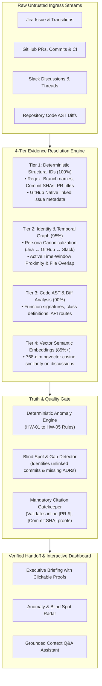

# KAIRO: Evidence Resolution, Grounding & Verification Architecture

> **Domain:** Architecture & System Design  
> **Document ID:** KAIRO-ARCH-VERIFICATION  
> **Status:** Production-Ready / Approved  
> **Scope:** 4-Tier Hybrid Evidence Resolution, Hallucination Prevention, Blind Spot Detection & Grounded Citations

---

## 1. The Verification Problem in Enterprise Work Reconstruction

When an AI engine generates a developer handoff briefing or answers technical questions about in-flight software projects, two catastrophic failure modes exist:

1. **Hallucination & Fake Progress:** The AI asserts that a feature is complete, secure, or tested when in reality it is half-baked, failing CI, or unmerged in a shadow branch.
2. **Context Blind Spots & Silent Omission:** The AI silently skips unlinked PRs, undocumented Slack debates, or architectural regressions because they were not explicitly tied to a Jira ticket ID.

To prevent both failure modes, KAIRO implements a **Dual-Verification & Evidence Resolution Architecture**:
- **Deterministic Truth:** Facts, timestamps, commit diffs, and issue states are derived purely from code and database integrity checks.
- **Strict Grounding:** The LLM synthesis layer cannot make ungrounded assertions; every claim must carry an inline, clickable evidence citation.
- **Active Gap Detection:** The system actively computes and highlights "Blind Spots" and "Known Unknowns" rather than guessing.



---

## 2. The 4-Tier Hybrid Evidence Resolution Engine

KAIRO resolves linkages between declared project work (Jira), observed code state (GitHub), and team communication (Slack) across 4 hierarchical tiers:

| Tier | Resolution Mechanism | Matching Inputs | Confidence Level | Primary Use Case |
| :--- | :--- | :--- | :--- | :--- |
| **Tier 1** | **Deterministic Structural IDs** | Exact Issue Keys (`PAY-421`), Closing Keywords (`Fixes #104`), Commit SHA prefixes | **100%** | Standard commits, branches with ticket prefix, PR metadata links |
| **Tier 2** | **Identity & Temporal Graph** | Canonical Persona (`(:Person)`), Active Time-Window overlap, Modified Module Proximity | **95%** | Vague commits ("wip", "fix") made during active task window on same files |
| **Tier 3** | **Code AST & Diff Analysis** | Tree-sitter AST nodes, API route decorators (`@app.post`), modified class/function names | **90%** | Feature implementations matching ticket acceptance criteria |
| **Tier 4** | **Vector Semantic Embeddings** | 768-dim `pgvector` embeddings with cosine similarity threshold $\ge 0.82$ | **85%+** | Unlinked Slack debates, technical design discussions, ADR context |

---

### Tier 1: Deterministic Structural IDs (100% Confidence)
- **Branch Name Extraction:** `^(?:feat|fix|chore|refactor)\/(?P<ticket>[A-Z]+-\d+)`
- **Commit Message Header Regex:** `^\[?(?P<ticket>[A-Z]+-\d+)\]?:?\s+(?P<summary>.+)`
- **GitHub PR Closing Keywords:** Automatically inspects `Fixes #...`, `Closes PAY-...`, and GitHub GraphQL linked issue associations.

### Tier 2: Identity & Temporal Graph (95% Confidence)
When developers do not format branch names or commit messages with Jira keys:
1. **Persona Canonicalization:** 
   Maps `github_username: "rahul-dev"`, `jira_account_id: "557058:a1b2c3"`, and `slack_email: "rahul@acme.com"` to a single Neo4j `(:Person {id: 'rahul'})` node.
2. **Active Time-Window Proximity:**
   Retrieves all commits and branches authored by Rahul while Jira issue `PAY-421` was in an `In Progress` or `In Review` state ($t_{start} \le t_{commit} \le t_{end}$).
3. **Module & File Touched Overlap:**
   Traverses `(Task)-[:AFFECTS_SERVICE]->(Service)<-[:BELONGS_TO]-(File)<-[:MODIFIES]-(PR)`. If overlap is found, edge `(Task)-[:EVIDENCE_DERIVED_FROM]->(PR)` is established with `confidence: 0.95`.

### Tier 3: Code AST & Diff Topology (90% Confidence)
- Parses Python, TypeScript, and Go diffs using Tree-sitter into Abstract Syntax Trees.
- Identifies newly added or modified:
  - API endpoint routes (e.g. `@router.post("/api/v1/payments/webhook")`)
  - Class definitions (e.g. `class StripePaymentGateway`)
  - Function declarations (e.g. `def verify_idempotency_key(...)`)
- Compares AST entities against Jira Acceptance Criteria keywords and entities.

### Tier 4: Vector Semantic Embeddings (85%+ Confidence)
- Generates 768-dimensional semantic embeddings for:
  - Jira ticket description & acceptance criteria
  - Slack message threads & channel discussions
  - Pull request summaries and Markdown ADRs
- Supported embedding model architectures:
  - **OpenAI:** `text-embedding-3-small` configured with `dimensions=768`
  - **Google Gemini:** `text-embedding-004` (natively 768-dimensional)
  - **Local/Offline Engine:** Deterministic software-engineering semantic concept-space projections with L2 normalization (and `fastembed` ONNX support)
- Computes cosine similarity in PostgreSQL using `pgvector`:
  $$\text{Sim}(v_{task}, v_{slack}) = \frac{v_{task} \cdot v_{slack}}{\|v_{task}\| \|v_{slack}\|}$$
- Only embeddings exceeding a strict threshold of **$\ge 0.82$** are linked as supporting evidence citations.

---

## 3. The 3-Layer Truth & Verification System

```
┌─────────────────────────────────────────────────────────────────────────┐
│                 3-LAYER TRUTH & VERIFICATION SYSTEM                     │
├─────────────────────────────────────────────────────────────────────────┤
│ 1. MANDATORY EVIDENCE CITATIONS (Proof on every claim)                  │
│    Every sentence requires inline [PR:#], [Commit:SHA], [Jira:KEY]      │
│                                                                         │
│ 2. DETERMINISTIC ANOMALY RULES (HW-01 to HW-05)                         │
│    Hardcoded boolean rules (Zero LLM hallucination in state checks)     │
│                                                                         │
│ 3. BLIND SPOT RADAR & COVERAGE SCORE                                    │
│    Explicitly highlights unlinked branches, missing ADRs & low coverage │
└─────────────────────────────────────────────────────────────────────────┘
```

### 3.1. Mandatory Evidence Citations (No Unproven Statements)
Every generated handoff summary undergoes a post-synthesis verification pass:
- Format: `[PR #<id>]`, `[Commit <sha:7>]`, `[Jira <key>]`, `[Slack <thread_id>]`.
- If an assertion does not map to a registered evidence ID in the payload's evidence manifest, the statement is rejected by the validator before reaching the API response.
- **Frontend Interaction:** Clicking any citation opens an in-situ side drawer rendering the raw sanitized diff, commit author, or Jira transition history.

### 3.2. Deterministic Anomaly Engine (HW-01 to HW-05)
State discrepancies (e.g., Jira is "Done" but PR is open or CI failed) are evaluated strictly in Python domain code (`apps/api/app/engines/anomaly_rules.py`). No LLM is permitted to determine whether work is in an anomaly state.

### 3.3. Blind Spot & Knowledge Gap Detection
Instead of presenting a false sense of completeness, KAIRO calculates a **Knowledge Coverage Score** and flags unlinked context:
- **Shadow Work Alert:** *"Developer pushed 3 branches (`temp-auth-fix`, `experiment/redis-cache`) with no linked Jira tickets."*
- **Missing Architecture Rationale Alert:** *"PR #104 replaced MongoDB with PostgreSQL, but no associated Architecture Decision Record (ADR) or Slack discussion was found."*
- **Unreviewed Code Alert:** *"Branch `feat/stripe-webhook` has 12 commits authored solely by Rahul with 0 peer reviews."*

---

## 4. Enterprise Onboarding & Integration Lifecycle

```
┌────────────────────────────────────────────────────────────────────────┐
│                        KAIRO ENTERPRISE LIFECYCLE                      │
├────────────────────────────────────────────────────────────────────────┤
│  STEP 1: 1-Click Integration (Day 0)                                   │
│          GitHub App + Jira Cloud OAuth + Slack Connect                 │
│                            │                                           │
│  STEP 2: Historical Sync & Cold-Start Graph Indexing (Past 30-90 Days) │
│          Postgres Tables + Neo4j Graph + pgvector 768-dim Embeddings   │
│                            │                                           │
│  STEP 3: Real-Time Passive Ingress & Background Anomaly Radar          │
│          FastAPI Webhooks (<20ms) ➔ Celery Workers ➔ Anomaly Checks   │
│                            │                                           │
│  STEP 4: Handoff Trigger Event (Reassignment / Offboarding)            │
│          Jira assignee changed OR Manager initiates transfer in UI     │
│                            │                                           │
│  STEP 5: Automated Reconstruction & Cited LLM Synthesis                │
│          2-Hop Neo4j Subgraph + Anomaly Evaluation + Grounded Briefing │
│                            │                                           │
│  STEP 6: Receiver's Interactive Experience (Day 1 for Incoming Dev)    │
│          Slack Magic Link ➔ Next.js Dashboard ➔ Grounded Q&A Assistant │
└────────────────────────────────────────────────────────────────────────┘
```

1. **Day 0 Onboarding:** Tenant account created; 1-click OAuth integration with GitHub App, Jira Cloud, and Slack. All ingested data is strictly scoped to `organization_id`.
2. **Cold-Start Sync:** Background ingestion of the past 30–90 days of commits, PRs, issue transitions, and discussions into Supabase and Neo4j.
3. **Passive Real-Time Ingress:** Inbound webhooks validated via HMAC signatures, parsed asynchronously by Celery workers to keep graph and vectors continuously synchronized.
4. **Handoff Trigger:** Jira assignee change or manual manager trigger invokes `ReconstructContext()`.
5. **Synthesis:** 2-hop neighborhood queried, anomalies detected, and cited briefing generated.
6. **Day 1 Consumption:** Incoming developer views interactive dashboard, checks off tasks, inspects evidence diffs, and queries the Grounded Q&A assistant with zero hallucinations.
