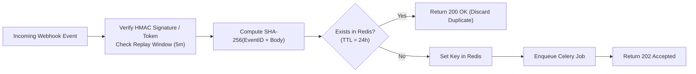

# KAIRO: Webhook Ingress Contracts & Verification

> **Domain:** API & Developer Contracts  
> **Document ID:** KAIRO-API-WEBHOOKS  
> **Standard:** Cryptographic Ingress with Non-Blocking Celery Queues  
> **Status:** Production-Ready / Enforced in CI

---

## 1. Webhook Endpoints Summary

| Endpoint | Source System | Signature / Token Header | Celery Handler Task | Response SLA |
| :--- | :--- | :--- | :--- | :--- |
| `POST /api/v1/webhooks/github[/{org_id}]` | GitHub App | `X-Hub-Signature-256`, `X-GitHub-Delivery`, `X-GitHub-Event` | `workers.tasks.ingest.process_github_webhook` | < 100ms |
| `POST /api/v1/webhooks/jira[/{org_id}]` | Jira Cloud | `X-Atlassian-Webhook-Identifier` | `workers.tasks.ingest.process_jira_webhook` | < 100ms |
| `POST /api/v1/webhooks/linear[/{org_id}]` | Linear App | `Linear-Event`, `Linear-Delivery` | `workers.tasks.ingest.process_linear_webhook` | < 100ms |
| `POST /api/v1/webhooks/gitlab[/{org_id}]` | GitLab | `X-Gitlab-Event`, `X-Gitlab-Token` | `workers.tasks.ingest.process_gitlab_webhook` | < 100ms |
| `POST /api/v1/webhooks/slack[/{org_id}]` | Slack Events API | `X-Slack-Signature`, `X-Slack-Request-Timestamp`, `X-Slack-Retry-Num` | `workers.tasks.slack_task.process_slack_event` | < 45ms (< 3s SLA) |

---

## 2. Ingress Idempotency Architecture

All webhook payloads return `202 Accepted` immediately upon cryptographic validation and are processed asynchronously by Celery workers to maintain sub-100ms ingress latency.

---

## 3. Cryptographic Rejection Contracts (Negative Paths)

Every webhook ingress endpoint enforces fail-closed cryptographic validation before reading or parsing payload contents:

* **Missing Signature / Token:** Returns `HTTP 401 Unauthorized` (`detail: "Missing mandatory <header>"`).
* **Invalid / Tampered Signature:** Returns `HTTP 401 Unauthorized` (`detail: "<Provider> HMAC signature verification failed"`).
* **Replay Attack Protection (Slack):** If `abs(time.time() - X-Slack-Request-Timestamp) > 300` (5 minutes), returns `HTTP 401 Unauthorized`.
* **Timing Attack Prevention:** All signature and token comparisons use constant-time `hmac.compare_digest`.
* **URL Verification Handshake (Slack):** Requests with payload `type: "url_verification"` return `HTTP 200 OK` with `{ "challenge": ... }` immediately.
