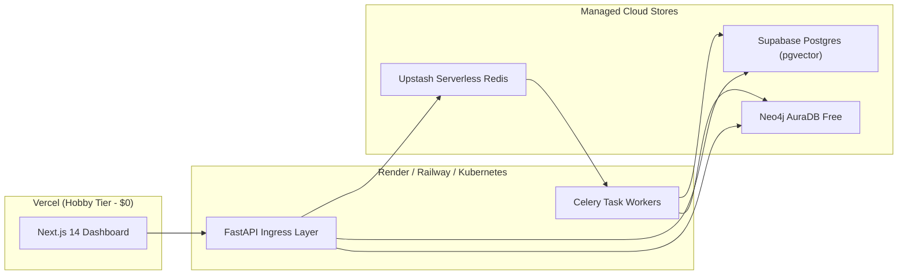
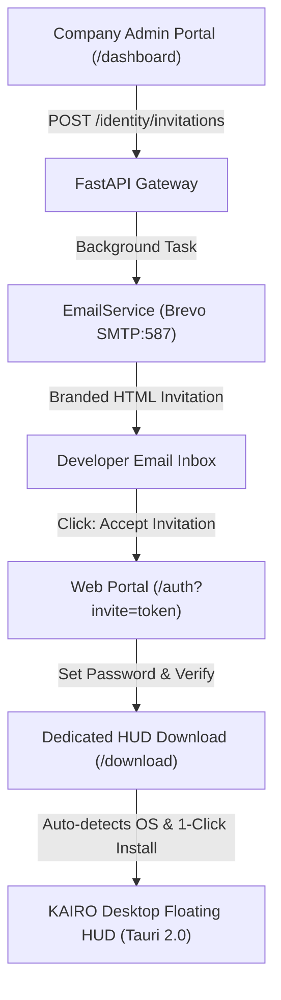

# KAIRO: Cloud & Kubernetes Production Deployment Guide

> **Domain:** DevOps & Infrastructure  
> **Document ID:** KAIRO-OPS-DEPLOY  
> **Target:** Serverless Free-Tier & Enterprise Kubernetes (EKS/GKE)

---

## 1. Dual-Tier Deployment Architectures



---

## 2. Zero-Downtime Schema Migrations

```bash
# Relational Migrations (PostgreSQL)
supabase db push --include-all

# Graph Migrations (Neo4j AuraDB)
python -m graph.apply_migrations
```

---

## 3. Configuration Reference

Every environment variable utilized by KAIRO across the API gateway, Celery workers, and web frontend is strictly validated on startup. In `APP_ENV=production`, insecure default values and missing credentials trigger immediate fail-fast termination.

| Environment Variable | Required | Default / Example | Purpose & Operational Scope | Where to Obtain (Third-Party Provider) |
| :--- | :---: | :--- | :--- | :--- |
| `APP_ENV` | Yes | `development` \| `staging` \| `production` | Deployment runtime target. Controls fail-fast validation and security constraints. | Infrastructure configuration |
| `SECRET_KEY` | Yes | High-entropy hex string (min 32 chars) | HMAC secret for signing and verifying JWT authentication tokens. | Generated via `openssl rand -hex 32` |
| `ACCESS_TOKEN_EXPIRE_MINUTES` | No | `1440` (24 hours) | JWT token lifespan in minutes before re-authentication is required. | Internal policy configuration |
| `DATABASE_URL` | Yes | `postgresql://postgres:<pwd>@<host>:5432/postgres` | PostgreSQL connection string for Alembic migrations and relational event storage. | Supabase / AWS RDS / local PostgreSQL |
| `SUPABASE_URL` | Yes | `https://<ref>.supabase.co` | REST API gateway URL for Supabase PostgREST client bindings. | Supabase Project Settings → API → URL |
| `SUPABASE_SERVICE_ROLE_KEY` | Yes | `eyJhbGciOi...` | High-privilege service role key for tenant administration and RLS bypass. | Supabase Project Settings → API → service_role key |
| `NEO4J_URI` | Yes | `bolt://localhost:7687` \| `neo4j+s://<id>.databases.neo4j.io` | Connection URI for the temporal provenance knowledge graph. | Neo4j AuraDB Console → Instance Details |
| `NEO4J_USER` | Yes | `neo4j` | Database username for Neo4j AuraDB cluster. | Neo4j AuraDB Console |
| `NEO4J_PASSWORD` | Yes | High-entropy password | Database password for Neo4j AuraDB cluster (default forbidden in prod). | Neo4j AuraDB Instance creation credentials |
| `REDIS_URL` | Yes | `redis://localhost:6379/0` \| `rediss://...` | Connection URL for distributed sliding-window rate limiter and Celery broker. | Upstash Redis Console / AWS ElastiCache |
| `CELERY_BROKER_URL` | No | Defaults to `REDIS_URL` | Explicit Celery message broker queue URL. | Managed Redis broker |
| `CELERY_RESULT_BACKEND` | No | Defaults to `REDIS_URL` | Celery task result backend URL. | Managed Redis / Database backend |
| `GITHUB_WEBHOOK_SECRET` | Yes | High-entropy secret | Secret used to cryptographically verify GitHub `X-Hub-Signature-256`. | GitHub Repository / App Settings → Webhooks |
| `JIRA_WEBHOOK_SECRET` | Yes | High-entropy secret | Secret used to verify Jira webhook payload signatures (`X-Hub-Signature`). | Atlassian Jira Administration → System → WebHooks |
| `LINEAR_WEBHOOK_SECRET` | Yes | High-entropy secret | Secret used to verify Linear HMAC signatures (`Linear-Signature`). | Linear Workspace Settings → API → Webhooks |
| `GITLAB_WEBHOOK_SECRET` | Yes | High-entropy secret | Secret token used to verify GitLab events (`X-Gitlab-Token`). | GitLab Project Settings → Webhooks → Secret Token |
| `SLACK_WEBHOOK_URL` | No | `https://hooks.slack.com/services/...` | Incoming webhook target for automated anomaly radar alerts and handoff digests. | Slack API Developer Console → Incoming Webhooks |
| `GROQ_API_KEY` | Conditional | `gsk_...` | High-throughput LPU inference key for sub-second grounded synthesis. | Groq Cloud Console (`console.groq.com`) |
| `GEMINI_API_KEY` | Conditional | `AIzaSy...` | Google Gemini API key for Gemini 1.5 Pro synthesis and text-embedding-004. | Google AI Studio (`aistudio.google.com`) |
| `OPENAI_API_KEY` | Conditional | `sk-proj-...` | OpenAI API key for GPT models and 768-dim text-embedding-3-small vectors. | OpenAI Platform Dashboard (`platform.openai.com`) |
| `LLM_MODEL_NAME` | No | `gemini-1.5-pro` | Model identifier string for grounded synthesis and reasoning. | Provider model registry |
| `LLM_TEMPERATURE` | No | `0.1` | Synthesis temperature (strictly low for grounded determinism). | Internal engine tuning |
| `CORS_ORIGINS` | No | `["http://localhost:3000","http://localhost:1420","tauri://localhost"]` | Allowed HTTP Origin headers (JSON array; wildcard forbidden in prod). | Security CORS whitelist |
| `NEXT_PUBLIC_API_URL` | No | `http://localhost:8000` | Backend gateway URL used by the Next.js company administrative portal. | Deployed API endpoint |
| `WEB_APP_URL` | No | `http://localhost:3000` | Frontend web URL for generated invitation links in emails. | Deployed Web Portal URL |
| `SMTP_HOST` | No | `smtp-relay.brevo.com` | Hostname for transactional email SMTP relay (Brevo, Gmail, AWS SES). | Brevo / Email Provider |
| `SMTP_PORT` | No | `587` | Port for SMTP relay with STARTTLS encryption. | Brevo / Email Provider |
| `SMTP_USER` | Conditional | `b874d7001@smtp-brevo.com` | SMTP account login identifier. | Brevo SMTP Settings |
| `SMTP_PASSWORD` | Conditional | `xsmtpsib-...` | SMTP account password or API master key. | Brevo SMTP Settings |
| `SMTP_FROM_EMAIL` | No | `adityaeeshan5230@gmail.com` | Verified sender address shown in employee invitation emails. | Brevo Senders Console |
| `SMTP_FROM_NAME` | No | `KAIRO Team` | Display name for outgoing invitation and notification emails. | Internal brand config |
| `WEB_APP_URL` | No | `https://kairo-web-91or.onrender.com` | Base URL of frontend web portal for email invite links and redirects. | Web deployment URL |

---

## 4. Upstash Serverless Redis & Celery Configuration

KAIRO uses Redis for two critical production responsibilities:
1. **Distributed Sliding-Window Rate Limiting (`apps/api/app/api/v1/auth.py`):** Protects authentication endpoints (`/api/v1/auth/login`, `/api/v1/auth/register`) against brute-force attacks across multi-replica container deployments using Redis Sorted Sets (`ZSET`).
2. **Celery Asynchronous Task Broker & Result Store (`workers/celery_app.py`):** Dispatches and queues webhook ingestion, OCR diagram parsing, Slack alert cards, and embedding calculations across 4 dedicated queues (`ingest`, `embeddings`, `alerts`, `diagram`).

### Connection String Format
For cloud deployments (such as Upstash or AWS ElastiCache), TLS is mandatory:
```bash
REDIS_URL="rediss://default:<password>@<host>.upstash.io:6379"
```

### Production Hardening & Retention Settings
* **Socket Timeouts:** Connection pool is configured with `socket_connect_timeout=5.0` and `socket_timeout=5.0` to prevent blocked worker threads during network blips.
* **Task Result Expiration:** `result_expires=86400` (24 hours TTL) ensures old Celery task result keys are pruned automatically, preventing memory growth.
* **Visibility Timeout:** `broker_transport_options={"visibility_timeout": 43200}` (12 hours) ensures long-running ingestion or backfill tasks are not redelivered prematurely.
* **Key Namespacing:** Rate limiter keys follow `kairo:ratelimit:auth:{client_identifier}` with explicit TTL matching the rate limit window.

---

## 5. Production Health & Readiness Verification

Before routing production traffic to KAIRO instances, verify that all dependencies are healthy:

```bash
# Verify API Health (Checks Supabase PostgreSQL, Redis, and Neo4j)
curl -s http://localhost:8000/api/v1/health | jq .
```

Expected response format:
```json
{
  "status": "healthy",
  "dependencies": {
    "supabase_postgresql": "operational",
    "neo4j_auradb": "operational",
    "redis": "operational"
  }
}
```

In `APP_ENV=production`, if any required service (PostgreSQL, Neo4j, or Redis) is unreachable, the API terminates immediately on startup to prevent routing traffic to degraded pods.

---

## 6. Brevo Transactional Email & Employee Onboarding Flow

KAIRO integrates transactional email dispatch via Brevo (formerly Sendinblue) SMTP relay, enabling fully automated, zero-friction developer provisioning:



### Key Operational Guarantees:
1. **Non-Blocking API Response:** Invitation creation responds in <25ms; email dispatch is offloaded to background worker threads.
2. **Cryptographic Single-Use Tokens:** Each invitation link carries a high-entropy URL-safe token expiring automatically after 7 days.
3. **Automated OS Detection:** The `/download` page detects user platform (Windows, macOS, Linux) and provides targeted installers and 1-line terminal setup commands (`winget`, `brew`, `curl | bash`).
4. **Graceful Degradation:** If SMTP credentials are missing or network connectivity to Brevo is interrupted, the invitation is still recorded in PostgreSQL/in-memory state, allowing manual link copy as a fail-safe fallback.
