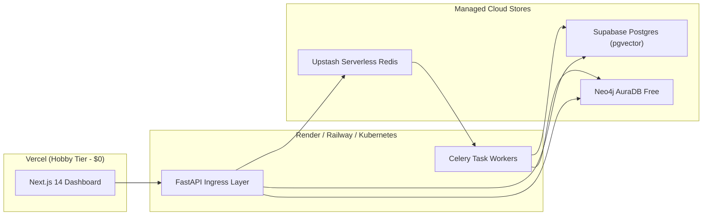

# KAIRO: Cloud & Kubernetes Production Deployment Guide

> **Domain:** DevOps & Infrastructure  
> **Document ID:** KAIRO-OPS-DEPLOY  
> **Target:** Serverless Free-Tier & Enterprise Kubernetes (EKS/GKE)

---

## 1. Dual-Tier Deployment Architectures



---

## 2. Zero-Downtime Schema Migrations

```bash
# Relational Migrations (PostgreSQL)
supabase db push --include-all

# Graph Migrations (Neo4j AuraDB)
python -m graph.apply_migrations
```
