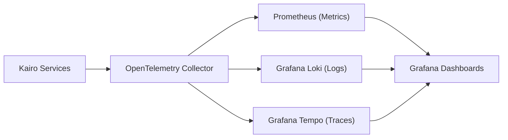

# KAIRO: Observability, Metrics & Telemetry Specification

> **Domain:** DevOps & Infrastructure  
> **Document ID:** KAIRO-OPS-OBS  
> **Stack:** OpenTelemetry, Prometheus, Grafana Loki, Tempo

---

## 1. Observability Architecture

---

## 2. Key Production Alerting Rules

* **`WebhookIngressLatencyHigh`:** p95 ingress response time $> 100\text{ms}$.
* **`CeleryQueueDepthHigh`:** Redis queue depth $> 500$ unprocessed tasks.
* **`LLMTimeoutRateHigh`:** LLM API failure rate $> 5\%$.
